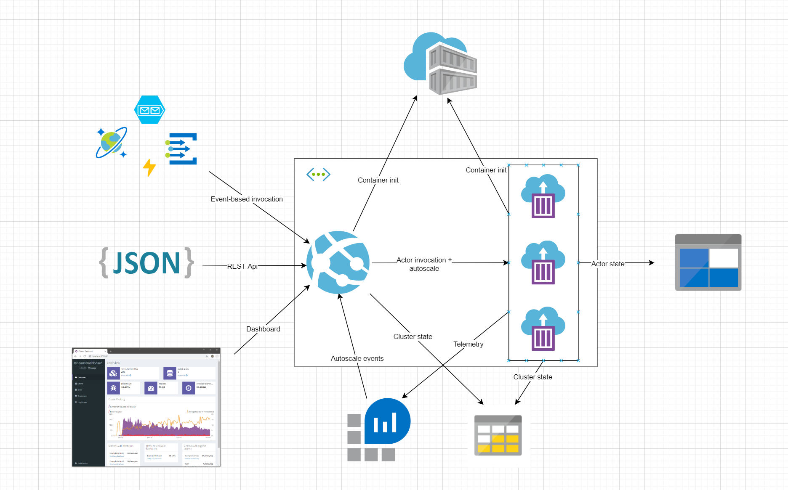

# Serverless Orleans

The goal of this project is to demonstrate a pragmatic approach to developing and hosting an actor-based application using ASP.NET Core, Azure App Service + WebJobs, Container Instances, and Orleans.

## Why Azure Container Instances?

A major drawback of most actor-based systems is the need to manage infrastructure. [Durable Entities](https://docs.microsoft.com/en-us/azure/azure-functions/durable/durable-functions-entities?tabs=csharp) solves this problem by layering an actor implementation on top of serverless Azure Functions; however, the DE actor implementation is rudimentary compared to other options and there are relatively few "knobs to twist" to optimize performance/scale for specific scenarios.

[Azure Container Instances](https://docs.microsoft.com/en-us/azure/container-instances/) provide a simple mechanism to run containers in Azure, without the overhead and management burden of a full-blown Kubernetes orchestrator underneath. You can configure VM size, vnet integration, etc. for running containers.

One drawback of ACI is the lack of an autoscale mechanism (something AKS does well). This project addresses this by hooking [alerts surfaced from Azure Monitor metrics](https://docs.microsoft.com/en-us/azure/azure-monitor/platform/alerts-metric). Alert rules are defined for CPU min/max thresholds, as well as webhook-based actions that execute when rule conditions are met; the webhook implementations add or remove ACI instances as needed to ensure adequate resources for in-flight, actor-based workloads.

## Why Azure App Service + WebJobs (and why not Azure Functions)?

In actor-based systems, actor instances typically interact with the outside world in one of two ways:

- direct invocation of actor methods, often from an API exposed to client applications, demonstrated [here](./host/MessagesController.cs)
- actors listen for and respond to external events... messages arriving on a queue, etc., demonstrated [here](./host/MessagesListener.cs)

Azure Functions have built-in support for [event-based triggers](https://docs.microsoft.com/en-us/azure/azure-functions/functions-triggers-bindings), and are an obvious choice to model the second pattern above. The issue with Functions is that they (by design) provide limited ability to configure the underlying host, which interferes with the ability to inject startup and configuration needed for efficient communication with Orleans clusters.

An alternative is to [use the WebJobs runtime and SDK](https://docs.microsoft.com/en-us/azure/app-service/webjobs-sdk-how-to) directly. Functions are built on top of WebJobs; the trigger mechanisms in Functions are defined in terms of WebJobs primitives and can be used from WebJobs code. In addition, WebJobs allow full configuration of the host process and are therefore a good fit here.

## Why actors?

https://www.brianstorti.com/the-actor-model/

## Why Orleans?

There are many available actor implementations:

- [Akka](https://akka.io/) and [Akka.NET](https://getakka.net/)
- [Service Fabric actors](https://docs.microsoft.com/en-us/azure/service-fabric/service-fabric-reliable-actors-introduction)
- [Dapr actors](https://github.com/dapr/docs/tree/master/concepts/actors#actors-in-dapr)
- languages like [Scala and Erlang](https://medium.com/@emqtt/erlang-vs-scala-5b5190326ef5)

[Orleans](https://dotnet.github.io/orleans/Documentation/index.html) is a .NET-based implementation of the [virtual actor pattern](https://www.microsoft.com/en-us/research/publication/orleans-distributed-virtual-actors-for-programmability-and-scalability/). It began as an incubation project in Microsoft Research, and has been [developed](https://github.com/dotnet/orleans), deployed, and continuously improved for over 10 years. It serves as the [foundation](https://dotnet.github.io/orleans/Community/Who-Is-Using-Orleans.html) for a number of high-scale cloud architectures both within and outside Microsoft.

In addition, Orleans has:

- a full .NET Core implementation
- a vibrant, community-oriented extensibility [ecosystem](https://github.com/OrleansContrib)
- full integration with [ASP.NET Core and generic .NET Core hosts](https://dotnet.github.io/orleans/Documentation/clusters_and_clients/configuration_guide/server_configuration.html)
- support for [journaling and event sourcing](https://dotnet.github.io/orleans/Documentation/grains/event_sourcing/index.html)

More info on Orleans [here](https://dotnet.github.io/orleans/Documentation/resources/links.html)

## Prerequisites

- [Docker](https://docs.docker.com/get-docker/) (use [this](https://docs.docker.com/docker-for-windows/wsl-tech-preview/) if you run WSL2 on Windows)
- [Visual Studio Code](https://code.visualstudio.com/download)
- [VS Code Docker extension](https://marketplace.visualstudio.com/items?itemName=ms-azuretools.vscode-docker)
- [VS Code C# extension](https://marketplace.visualstudio.com/items?itemName=ms-dotnettools.csharp)
- [.NET Core 3.x SDK](https://dotnet.microsoft.com/download)
- [Azure Storage Explorer](https://azure.microsoft.com/en-us/features/storage-explorer/)
- [Postman](https://www.postman.com/)

## Local dev and debugging

- Right-click [docker-compose.yml](./docker-compose.yml) and select 'Compose Up'. This will build and launch the containers defined in the YAML file
- Set breakpoints as desired
- Launch the VS Code debugger with F5. VS Code will attach to the 'frontend' container with a remote debugger session
- Using Storage Explorer, connect to Azurite emulated storage. Create a new queue called 'input' and add a message to it with a simple text body ('hello world' or similar)
- Using Postman or curl, send an HTTP GET request to http://localhost:5000/api/messages
- When finished, right-click [docker-compose.yml](./docker-compose.yml) and select 'Compose Down'

## Azure deployment

From a bash shell, run [azure_deploy.sh](./azure_deploy.sh) as follows:

<pre>
./azure_deploy.sh <i>root-resources-name</i>
</pre>

## Future plans

- [Event-sourced](https://dotnet.github.io/orleans/Documentation/grains/event_sourcing/index.html) actor state
- Scalability and load testing (multiple app service nodes, etc.)
- Node.js and/or Python interop (define actor logic in Node or Python, with a common .NET foundation)
